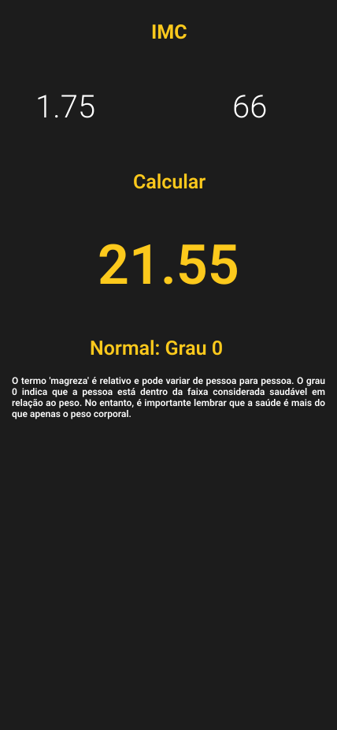

# IMC

Calculadora de IMC criada em flutter.

## Projeto

IMC é a sigla para Índice de Massa Corpórea, parâmetro adotado pela Organização Mundial de Saúde para calcular o peso ideal de cada pessoa..

